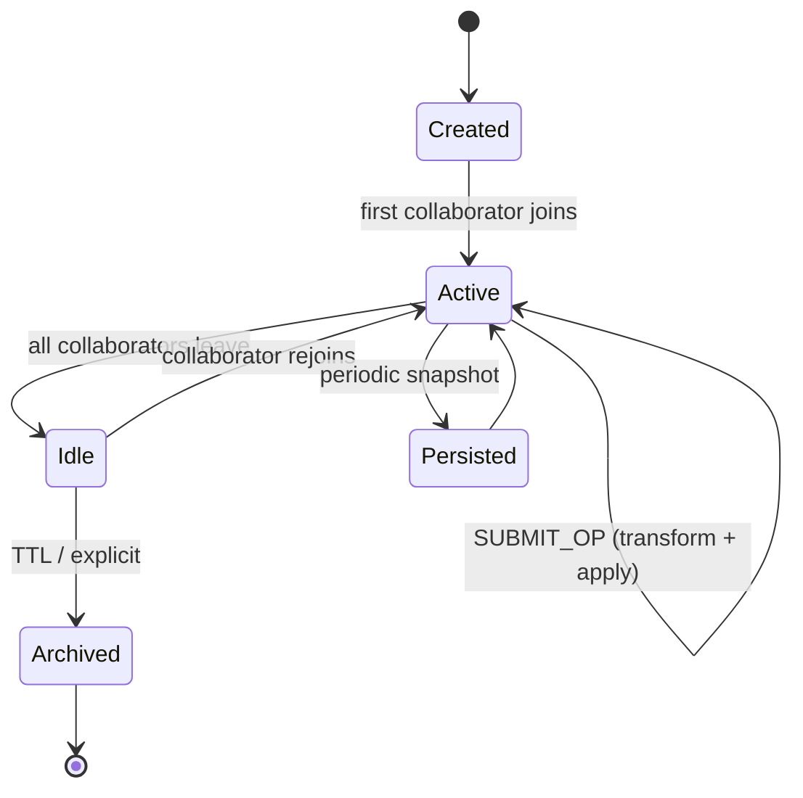
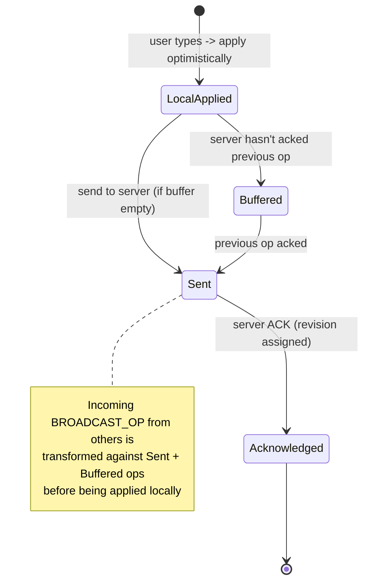
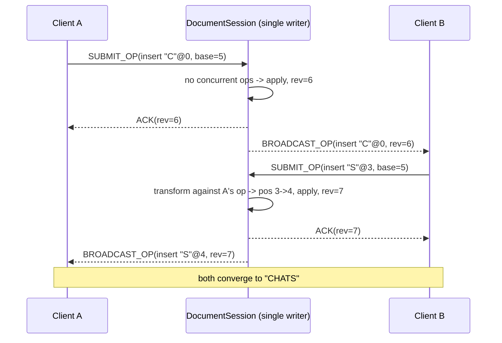

# LLD: Collaborative Text Editor (Google Docs / Bluescape)

> The single most important judgment call in this problem: **for a Google-Docs-style editor you do NOT lock.**
> Locking a block while one person edits destroys the defining feature — simultaneous editing. The correct answer is
> **Operational Transformation (OT)** (server-mediated) or **CRDTs** (coordination-free). The "message queue / lock"
> hint your interviewer gave is about **establishing a total order of operations**, not blocking users.

---

## 1. How to frame it (say this first)

Spend 60–90 seconds scoping. It signals seniority and stops you from designing the wrong thing.

**Functional**
- Multiple users open and edit the same document concurrently, in real time.
- Edits = insert / delete / format text. Changes propagate to all connected clients near-instantly.
- Presence: see other users' cursors and selections.
- Persistence + version history (undo/redo, restore).
- Access control: Owner / Editor / Commenter / Viewer.
- (Stretch) Offline edit, then converge on reconnect.

**Non-functional**
- **Low local latency** — edits apply optimistically on the client immediately (no server round-trip to type).
- **Convergence (eventual consistency)** — all clients end at the *same* document state.
- **No data loss** — concurrent edits to the same region must *both* survive (this is the bar LWW fails).
- High availability, horizontal scalability (millions of docs, dozens of live editors per doc).

The non-functional list is what kills the naive solutions: "low latency + no data loss + simultaneous editing" rules out
both locking (kills latency/simultaneity) and last-write-wins (loses data).

---

## 2. Actors & actions

| Actor | Actions |
|---|---|
| **Owner** | Create, edit, delete doc; manage permissions; transfer ownership |
| **Editor** | Open, edit (insert/delete/format), comment, view history |
| **Commenter** | Open, read, add comments/suggestions — no content mutation |
| **Viewer** | Open, read only |
| **System (Sync server)** | Sequence ops, transform, broadcast, persist, manage presence |

`Permission` is a role enum on the (user, document) pair. Authorization check happens at the API edge and again when an
operation is admitted to a doc's op stream.

---

## 3. The core decision: concurrency model

This is where the interview is won or lost. Walk through the options and land on OT/CRDT with reasons.

### Option A — Pessimistic locking (what you proposed: distributed lock per block)
Lock a block/section; only the lock holder edits it.
- **Where it's valid:** Notion/Confluence-style *block* documents, spreadsheet cells, wiki sections — coarse, structured units where one author per unit is acceptable.
- **Why it's wrong for Google Docs:** character-level free text. Two people can't co-write the same sentence; cursor contention, lock latency, and lock-holder crashes (need lease/TTL via Redis Redlock or ZooKeeper) all degrade the core UX. **Locking contradicts the product.**

### Option B — Last-Write-Wins / timestamp "conflict tree" (your fallback)
Timestamp every edit; latest wins.
- **Fatal flaw:** it's *destructive*. If A and B edit the same paragraph, one person's text silently vanishes. Acceptable only for coarse *metadata* (title, doc settings) — never for text content.
- This is why the interviewer was lukewarm: it converges, but by *deleting* edits.

### Option C — Operational Transformation (OT) — **the Google Docs answer**
Represent every edit as an **operation** (`insert(pos, char)`, `delete(pos, len)`). When two ops are made concurrently
against the same base, **transform** one against the other so both can apply in any order and still converge with
*intentions preserved*. A central server assigns a canonical order.
- **Pros:** no locking, full simultaneous editing, no data loss, compact ops.
- **Cons:** transform functions are hard to get correct; needs a server to sequence (TP1); decentralized OT (TP2) is notoriously tricky.

### Option D — CRDTs (RGA / LSEQ / Logoot; Yjs, Automerge)
Give every character a globally-unique, totally-ordered ID. Operations are **commutative**, so they converge regardless
of delivery order — *no central coordinator required*.
- **Pros:** great for offline / P2P, no transform logic, no server-side ordering needed.
- **Cons:** metadata/tombstone overhead per character (memory), more complex data structure, harder text-position queries.

**Verdict to state:** "For a Google-Docs-style editor I'd use **OT with a central sequencer** — it's what Google Docs
historically used (Wave/Jupiter model), gives optimistic local edits with guaranteed convergence and no data loss. If
strong offline/P2P support were a hard requirement, I'd choose a **CRDT** instead. I would *not* lock, because that
removes simultaneous editing — the whole point."

### Worked OT example (use this — it makes the concept land instantly)
Base doc = `HAT`, revision 5.
- User **A** inserts `"C"` at pos 0 (wants `CHAT`).
- User **B** *concurrently* inserts `"S"` at pos 3 (wants `HATS`). Both ops carry `baseRevision = 5`.

Server receives A first → applies → `CHAT`, revision 6, broadcasts A.
Server receives B, but B was based on rev 5 while doc is now rev 6 → **transform B against A**:
A inserted 1 char at pos 0, and `0 ≤ 3`, so B's position shifts `+1` → 4. Apply `"S"` at pos 4 of `CHAT` → `CHATS`.

Both clients converge to **`CHATS`**, both edits survive, both intentions preserved. LWW would have dropped one of them.

Insert/insert transform (the heart of it):
```
transform(opB, opA):              // adjust opB to apply *after* opA
  if opA.pos < opB.pos:           opB.pos += opA.len
  elif opA.pos > opB.pos:         (unchanged)
  else:                           # tie — break deterministically by siteId/authorId
      if opA.siteId < opB.siteId: opB.pos += opA.len
```
Delete/insert and delete/delete follow the same position-shifting logic. The deterministic tie-break is what guarantees
every replica makes the *same* choice.

**Correctness vocabulary (drop these terms):** OT must satisfy the **CCI model** — **C**onvergence, **C**ausality
preservation, **I**ntention preservation — and the transform must satisfy **TP1** (for server-ordered OT) and **TP2**
(only if you allow decentralized re-ordering).

---

## 4. Entities / class design

```java
// ---- Domain ----
class Document {
    String       docId;
    String       title;
    String       ownerId;
    long         currentRevision;       // monotonic, assigned by server
    TextBuffer   buffer;                // rope / piece-table (see note below)
    Instant      createdAt;
    // op log persisted separately (see OperationStore)
}

class User { String userId; String name; String email; }

enum Role { OWNER, EDITOR, COMMENTER, VIEWER }

class Permission { String userId; String docId; Role role; }

// ---- Operations (the unit of change) ----
enum OpType { INSERT, DELETE, FORMAT }

abstract class Operation {
    String  opId;            // client-generated UUID — for idempotency / ack matching
    String  authorId;
    String  siteId;          // deterministic tie-break
    long    baseRevision;    // revision the client was on when it created this op
    OpType  type;
}
class InsertOp extends Operation { int pos; String text; }
class DeleteOp extends Operation { int pos; int length; }
class FormatOp extends Operation { int pos; int length; Map<String,Object> attrs; } // bold, color...

// ---- Live editing session ----
class Session {                          // one active editor connection
    String  sessionId;
    String  userId;
    String  docId;
    int     cursorPos;
    Range   selection;
    Channel connection;                  // WebSocket
}

// ---- Services ----
interface OTEngine {                      // pure transform logic
    Operation transform(Operation incoming, Operation against);
    List<Operation> transformAgainstAll(Operation op, List<Operation> concurrent);
}

class DocumentSession {                    // authoritative state for ONE doc (single-writer)
    Document doc;
    Deque<Operation> recentOps;            // since some checkpoint, for transforming
    Map<String, Session> collaborators;
    long applyAndSequence(Operation clientOp); // transform → apply → assign revision → broadcast
}

interface OperationStore {                 // append-only op log + periodic snapshots
    long append(String docId, Operation op);
    List<Operation> opsSince(String docId, long revision);
    Snapshot latestSnapshot(String docId);
}

class PresenceService { /* cursors, selections, who's online */ }
class VersionHistory  { /* snapshots + op replay → restore any revision */ }
```

**Text data structure (a senior-level detail worth 30 seconds):** don't store the doc as a flat `String`/array —
inserts/deletes become `O(n)` and large docs thrash. Use a **rope** or **piece table** for `O(log n)` edits and cheap
versioning. Piece tables (append-only original + add buffer) also make undo and history natural.

---

## 5. APIs

**REST — document lifecycle (stateless, request/response):**
```
POST   /documents                      -> create, returns docId
GET    /documents/{id}                 -> metadata + latest snapshot
PUT    /documents/{id}/permissions     -> { userId, role }
GET    /documents/{id}/history         -> list of snapshots/revisions
POST   /documents/{id}/restore         -> { revision }
```

**WebSocket — real-time editing (the "Update text block API" she asked about):**
```
C → S  JOIN        { docId, clientRevision }
C → S  SUBMIT_OP   { docId, op, baseRevision, opId }     // the edit
S → C  ACK         { opId, assignedRevision }            // your op was sequenced
S → C  BROADCAST_OP{ op, revision }                      // someone else's op (already transformed)
C ⇄ S  PRESENCE    { cursorPos, selection }
```

The `SUBMIT_OP` call is the answer to "how do you update a text block and handle two people on it" — the server
transforms it against any concurrent ops since `baseRevision`, assigns a revision, and broadcasts. No lock anywhere.

---

## 6. State transformations

### 6a. Document lifecycle


### 6b. Operation lifecycle (client side — the OT sync model)
The client keeps three things: **acknowledged state**, a **buffer of sent-but-unacked ops**, and **pending local ops**.
This is the classic Jupiter / Google Wave client-server model.


### 6c. Server-side sequencing (per document)


---

## 7. Architecture & where the "message queue" actually fits

The interviewer's "message queue / lock" hint = the mechanism that gives operations a **single total order per
document**. You don't lock the *user* — you serialize the *operations*.

Concrete ways to serialize, in increasing scale:
1. **Single-writer per doc (actor model).** Each open document is owned by exactly one server process/actor; all ops
   for that doc route to it. The actor's mailbox *is* the queue — it processes ops one at a time, assigns revisions,
   transforms, broadcasts. No distributed lock needed; the routing guarantees serialization. (Akka, Erlang-style, or a
   consistent-hash on `docId`.)
2. **Per-doc partitioned log (e.g., Kafka partition keyed by docId).** Ops for a doc land in one partition → naturally
   ordered. A consumer applies them in offset order. The offset *is* the revision number. Durable + replayable, which
   doubles as your op log for history.
3. **Optimistic concurrency at the store** (`appendIfRevision == expected`) as a backstop if two writers race.

So the right framing when pushed: *"I'd serialize operations per document — either by routing each doc to a single
owning process (actor mailbox as the queue) or via a per-doc partitioned log. That total order is what OT needs. I would
not take a per-block distributed lock, because that prevents two people from editing the same block, and simultaneous
editing is the product."*

**Scale-out:** consistent-hash `docId` → server, so a doc's ops always reach its owner. State on that node + periodic
snapshots to durable storage (op log + snapshot in S3/DB; Redis for presence and fast recent-op cache). On node failure,
rehydrate the doc from `latestSnapshot + opsSince(snapshot.revision)`.

---

## 8. Trade-off summary

| Approach | Simultaneous edit | Data loss | Coordination | Complexity | Use when |
|---|---|---|---|---|---|
| **Per-block lock** | ❌ blocks | none (serialized) | distributed lock + lease | low | structured block docs, spreadsheet cells |
| **Last-write-wins** | ✅ | ❌ loses edits | timestamp/clock | very low | coarse metadata only (title, settings) |
| **OT (central)** | ✅ | none | server sequencer | high (transforms) | **Google Docs, central server** |
| **CRDT** | ✅ | none | none required | high (data structure/memory) | offline-first, P2P, multi-region |

---

## 9. Answering the exact pushback you got

- **"How do you prevent two users editing the same block?"**
  Reframe: *you don't prevent it — you make it safe.* Both edits are operations; the server transforms them so both
  apply and converge. Locking would prevent the feature, not protect it.
- **"Use a distributed lock?"**
  Only for coarse, structured units (cells, blocks). For character-level co-editing it's the wrong tool — say so and
  pivot to OT/CRDT. Showing you know *when* locking is appropriate is the senior signal.
- **"Use a message queue?"**
  Yes — as a **per-doc ordering mechanism** (partitioned log / actor mailbox), to give operations a total order, *not*
  to lock editing. The queue's offset becomes the revision number.
- **Last-write-wins / conflict tree:**
  Fine for metadata; unacceptable for text because it deletes one user's work. Name the failure explicitly.

**One-line close for the interview:** *"No locks for text. Operations + Operational Transformation, serialized per
document via a single-writer log/actor; optimistic local apply for latency, server-assigned revisions for convergence,
op-log + snapshots for history and recovery. CRDTs if offline/P2P is a hard requirement."*
